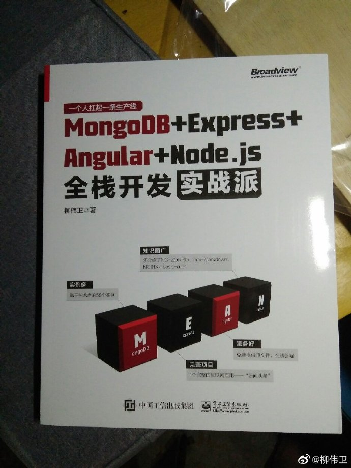

# MEAN Samples. 《MongoDB＋Express＋Angular＋Node.js全栈开发实战派》源码

## 内容简介

以MongoDB、Express、Angular和Node.js四种技术为核心的技术栈（MEAN架构），被广泛应用于全栈Web开发。

《MongoDB＋Express＋Angular＋Node.js全栈开发实战派》最终带领读者从零开始实现一个完整的、企业级的、前后端分离的应用——“新闻头条”，使读者具备用MEAN架构完整开发企业级应用的能力。

本书分为6篇。第1篇介绍MEAN架构的基础概念，使读者对MEAN架构有一个初步的印象。第2篇介绍全栈开发平台Node.js的常用知识点，包括模块、测试、缓冲区、事件处理、文件处理、HTTP编程等。第3篇介绍Web服务器Express的常用知识点。第4篇介绍NoSQL数据库MongoDB的常用知识点，以及其在Node.js中的应用。第5篇介绍前端应用开发平台Angular的常用知识点，包括组件、模板、数据绑定、指令、服务、依赖注入、路由、响应式编程、HTTP客户端等。第6篇带领读者实现一个完整的应用——“新闻头条”。

第2～5篇介绍了58个实例，将理论讲解最终落实到代码实现上。随着图书内容的推进，这些实例不断趋近于工程项目，具有很高的应用价值和参考价值。

本书由浅入深、层层推进、结构清晰、实例丰富、通俗易懂、实用性强，适合MEAN架构的初学者和进阶读者作为自学用书，也适合培训学校作为培训教材，还适合大、中专院校的相关专业作为教学参考书。

## 本书所涉及的技术及相关版本

本书所采用的技术及相关版本较新，请读者将相关开发环境设置成与本书所采用的一致，或者不低于本书所列的配置。

* Node.js 12.9.0
* npm 6.12.2
* Express 4.17.1
* MongoDB Community Server 4.0.10
* mongodb 3.3.1
* Angular CLI 8.3.0
* NG-ZORRO 8.1.2
* basic-auth 2.0.1
* ngx-markdown 8.1.0
* NGINX 1.15.8

## 案例源码

* [hello-world](samples/hello-world)：第一个Node.js应用
* [deep-strict-equal](samples/deep-strict-equal/)：deepStrictEqual示例
* [buffer-demo/character-encodings.js](samples/buffer-demo/character-encodings.js)：指定字符编码
* [buffer-demo/buffer-slice.js](samples/buffer-demo/buffer-slice.js)：切分缓冲区
* [buffer-demo/buffer-concat.js](samples/buffer-demo/buffer-concat.js)：连接缓冲区
* [buffer-demo/buffer-compare.js](samples/buffer-demo/buffer-compare.js)：比较缓冲区
* [buffer-demo/buffer-read.js](samples/buffer-demo/buffer-read.js)：缓冲区解码
* [buffer-demo/buffer-write.js](samples/buffer-demo/buffer-write.js)：缓冲区编码
* [events-demo/parameter-this.js](samples/events-demo/parameter-this.js)：监听事件
* [events-demo/parameter-lambda.js](samples/events-demo/parameter-lambda.js)：lambda方式监听事件
* [events-demo/set-immediate.js](samples/events-demo/set-immediate.js)：异步模式监听事件
* [events-demo/emitter-once.js](samples/events-demo/emitter-once.js)：仅处理事件一次
* [events-demo/error-event.js](samples/events-demo/error-event.js)：为error事件注册监听器
* [events-demo/event-names.js](samples/events-demo/event-names.js)：获取已注册的事件的名称
* [events-demo/event-listeners.js](samples/events-demo/event-listeners.js)：获取监听器数组的副本
* [events-demo/prepend-listener.js](samples/events-demo/prepend-listener.js)：将事件监听器添加到监听器数组的开头
* [events-demo/remove-listener.js](samples/events-demo/remove-listener.js)：移除监听器
* [fs-demo/fs-open.js](samples/fs-demo/fs-open.js)：打开文件
* [fs-demo/fs-read.js](samples/fs-demo/fs-read.js)：读取文件
* [fs-demo/fs-read-dir.js](samples/fs-demo/fs-read-dir.js)：读取目录
* [fs-demo/fs-read-file.js](samples/fs-demo/fs-read-file.js)：读取文件的全部内容
* [fs-demo/fs-write.js](samples/fs-demo/fs-write.js)：写入文件
* [fs-demo/fs-write-string.js](samples/fs-demo/fs-write-string.js)：将字符串写入文件
* [fs-demo/fs-write-file.js](samples/fs-demo/fs-write-file.js)：将数据写入文件
* [http-demo/hello-world.js](samples/http-demo/hello-world.js)：第一个HTTP服务器
* [http-demo/rest-service.js](samples/http-demo/rest-service.js)：构建REST服务的例子
* [express-demo](samples/express-demo)：Express示例
* [express-rest](samples/express-rest)：Express REST 示例
* [mongodb-demo](samples/mongodb-demo)：操作MongoDB的例子
* [angular-demo](samples/angular-demo)：Angular应用的例子
* [life-cycle](samples/life-cycle)：Angular生命周期钩子的例子
* [component-interaction](samples/component-interaction)：Angular组件交互方式
* [component-style](samples/component-style)：Angular使用组件样式的例子
* [attribute-directives](samples/attribute-directives)：使用属性型指令的例子
* [structural-directives](samples/structural-directives)：自定义结构型指令
* [dependency-injection](samples/dependency-injection)：依赖注入的例子
* [router](samples/router)：路由器的例子
* [http-client](samples/http-client)：HttpClient的例子
* [mean-news-ui](samples/mean-news-ui)：新闻头条前端UI客户端应用
* [mean-news-server](samples/)：新闻头条后台服务器应用

## 配套书籍《MongoDB＋Express＋Angular＋Node.js全栈开发实战派》

与该源码配套的书籍《MongoDB＋Express＋Angular＋Node.js全栈开发实战派》已经出版，内容详见全书[目录](SUMMARY.md)。

本书如有勘误，会在<https://github.com/waylau/mean-book-samples/issues>上进行发布。由于笔者能力有限，时间仓促，难免错漏，欢迎读者批评指正。

您也可以上[豆瓣](https://book.douban.com/subject/35085913/)给老卫打Call。

## 如何获取本书

实体店及各大网店有售。据我所知有如下网站供应：

* [京东](https://search.jd.com/Search?keyword=%E6%9F%B3%E4%BC%9F%E5%8D%AB%20MongoDB%2BExpress%2BAngular%2BNode.js%E5%85%A8%E6%A0%88%E5%BC%80%E5%8F%91%E5%AE%9E%E6%88%98%E6%B4%BE&enc=utf-8&wq=%E6%9F%B3%E4%BC%9F%E5%8D%AB%20MongoDB%2BExpress%2BAngular%2BNode.js%E5%85%A8%E6%A0%88%E5%BC%80%E5%8F%91%E5%AE%9E%E6%88%98%E6%B4%BE&pvid=01572d08e57c46bd9723205d5ba13644)
* [1号店](https://search.yhd.com/c0-0/k%25E6%259F%25B3%25E4%25BC%259F%25E5%258D%25AB%2520MongoDB%252BExpress%252BAngular%252BNode.js%25E5%2585%25A8%25E6%25A0%2588%25E5%25BC%2580%25E5%258F%2591%25E5%25AE%259E%25E6%2588%2598%25E6%25B4%25BE/)
* [淘宝](https://s.taobao.com/search?q=%E6%9F%B3%E4%BC%9F%E5%8D%AB+MongoDB%2BExpress%2BAngular%2BNode.js%E5%85%A8%E6%A0%88%E5%BC%80%E5%8F%91%E5%AE%9E%E6%88%98%E6%B4%BE&imgfile=&commend=all&ssid=s5-e&search_type=item&sourceId=tb.index&spm=a21bo.2017.201856-taobao-item.1&ie=utf8&initiative_id=tbindexz_20170306)
* [当当](http://search.dangdang.com/?key=%C1%F8%CE%B0%CE%C0%20MongoDB%2BExpress%2BAngular%2BNode.js%C8%AB%D5%BB%BF%AA%B7%A2%CA%B5%D5%BD%C5%C9&act=input)
* [亚马逊](https://www.amazon.cn/s?k=%E6%9F%B3%E4%BC%9F%E5%8D%AB+MongoDB%2BExpress%2BAngular%2BNode.js%E5%85%A8%E6%A0%88%E5%BC%80%E5%8F%91%E5%AE%9E%E6%88%98%E6%B4%BE&__mk_zh_CN=%E4%BA%9A%E9%A9%AC%E9%80%8A%E7%BD%91%E7%AB%99&ref=nb_sb_noss)

想低于市价得到本书？来[二手书集市](https://github.com/waylau/second-hand-books)试试看。

也可以直接关注我博客（<https://waylau.com/>）或者我的开源书（<https://waylau.com/books/>）了解更多免费咨询。

 
## 联系作者

您也可以直接联系我：

* 博客：https://waylau.com
* 邮箱：[waylau521(at)gmail.com](mailto:waylau521@gmail.com)
* 微博：http://weibo.com/waylau521
* 开源：https://github.com/waylau

## 其他书籍

若您对本书不感冒，笔者还写了其他方面的超过一打的书籍（可见<https://waylau.com/books/>），多是开源电子书。

本人也维护了一个[books-collection](https://github.com/waylau/books-collection)项目，里面提供了优质的专门给程序员的开源、免费图书集合。

## 开源捐赠

捐赠所得所有款项将用于开源事业！见[捐赠](https://waylau.com/donate)列表。